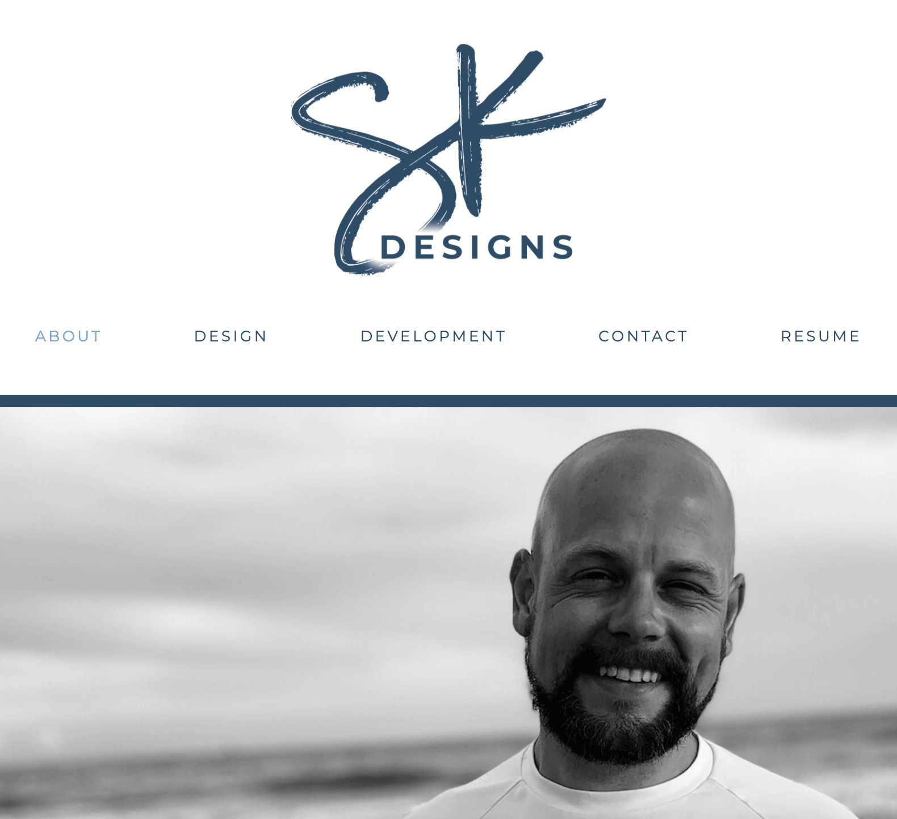

# SK Designs

## Description
SK Designs is the professional portfolio for Shelby Kohring and is a free lance graphic design and web development firm operated by Shelby. 

- [See the SK Designs site at shelbykohring.com](www.shelbykohring.com)
- [See the GitHub Repository for SK Designs here](https://github.com/shelbykohring/kohringsw-react)

## Table of Contents
- [Description](#description)
- [Usage](#usage)
- [Contributors](#contributors)
- [Questions](#questions)

## Usage
You can use this professional portfolio for Shelby Kohring to do the following:
- Learn about who Shelby is
- See some of Shelby's graphic design work
- See some of Shelby's web development projects
- Contact Shelby
- See Shelby's resume
- You can also connect to all of Shelby's social media profiles in the footer of his site including [GitHub](https://www.github.com/shelbykohring), [Linked In](https://www.linkedin.com/in/shelbykohring/), [Instagram](https://www.instagram.com/shelbykohring), and [Twitter](https://twitter.com/shelbykohring/).

## Contributors
Shelby Kohring

## Questions
If you have questions about this application: 
- Find me on [GitHub: kohringsw](https://github.com/shelbykohring) or 
- Email me at [kohringsw@gmail.com](mailto:kohringsw@gmail.com)
